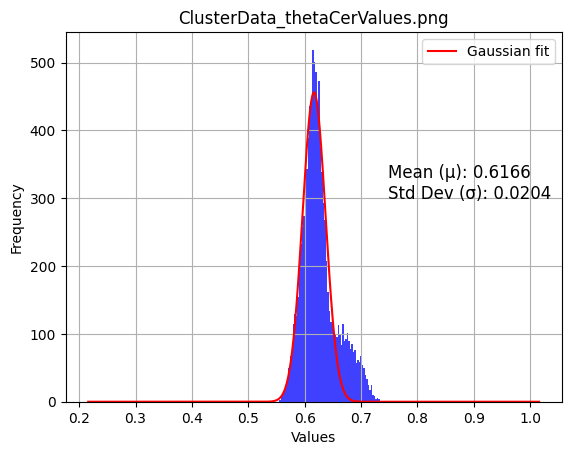
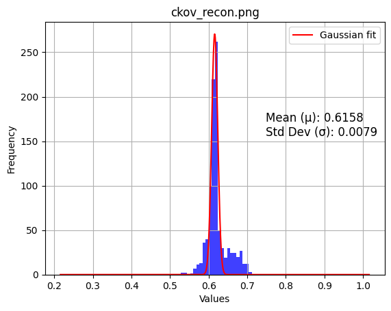
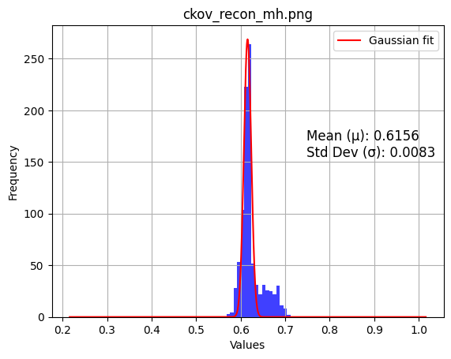
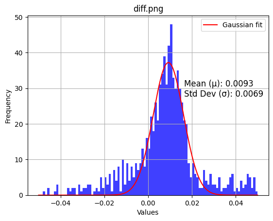
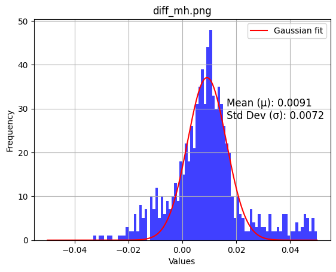

# Scatterplots
**make_ckov_prediction_cut_fig** in [HMPID_ML.ipynb](../ML/HMPID_ML.ipynb)

#### Predicted specie kaon 

The figure shows the probablity scatter plot per true specie

#### Predicted specie proton

The figure shows the probablity scatter plot per true specie

# Metrics comparison
**HMP_HTM.ipynb**

**Efficiciency and Purity vs momentum**

## With masshypothesis :

Change by changning from **TrackAttributes_ckovReconMassHypThisTrack** to **TrackAttributes_ckovReconThisTrack** for **ckov_recon** in **calculate_contamination** / **calculate_purity_efficiency**

### Section Contamination

### Section Normalised

### Section "Efficiciency and Purity vs momentum"

### Section Plot Ckov photons histograms

Reconstructed Cherenkov angle with and without MH

    
    

Difference between theoretical values and reconstruted values:

    
    

