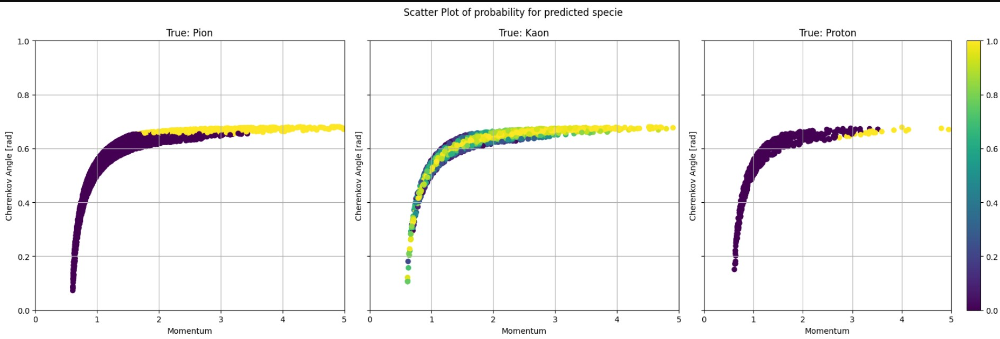
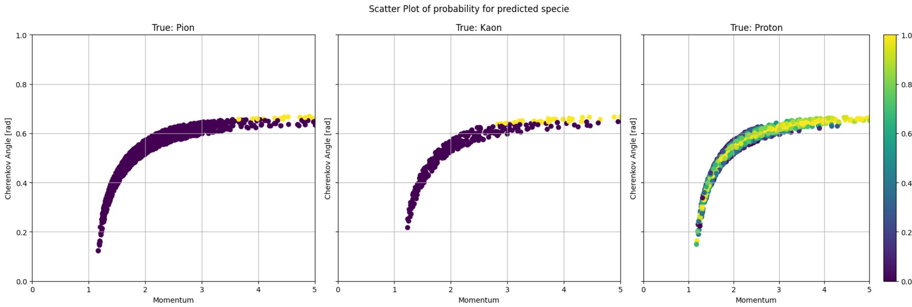
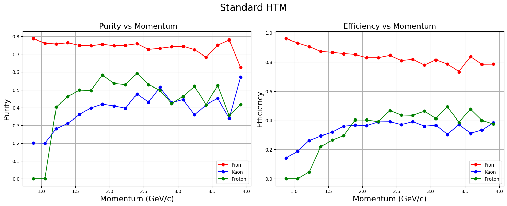
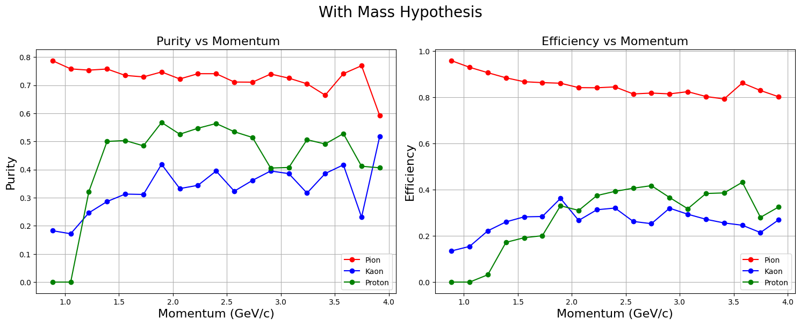
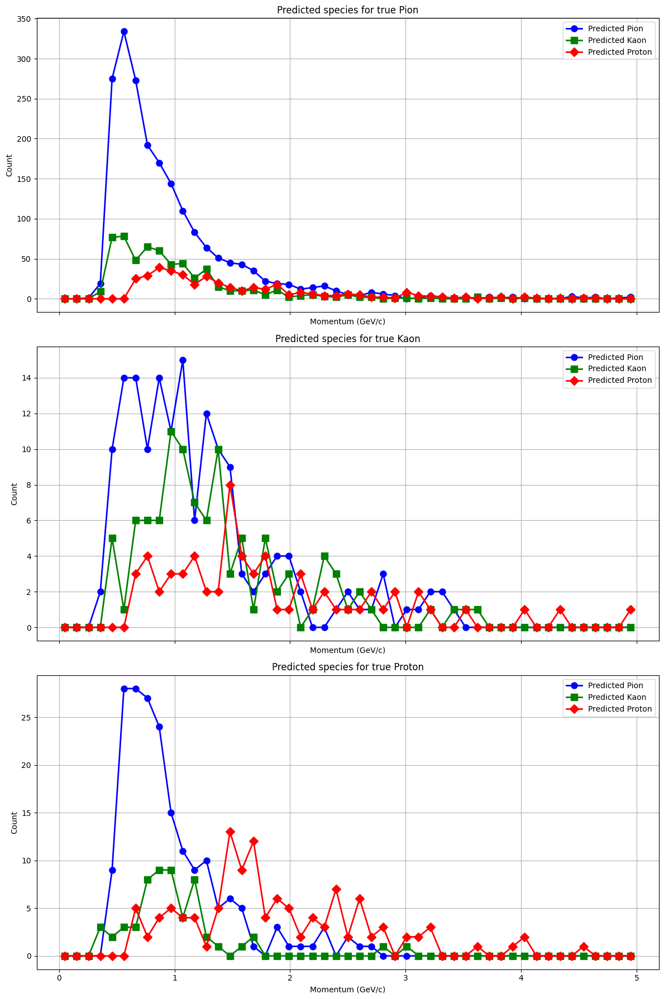
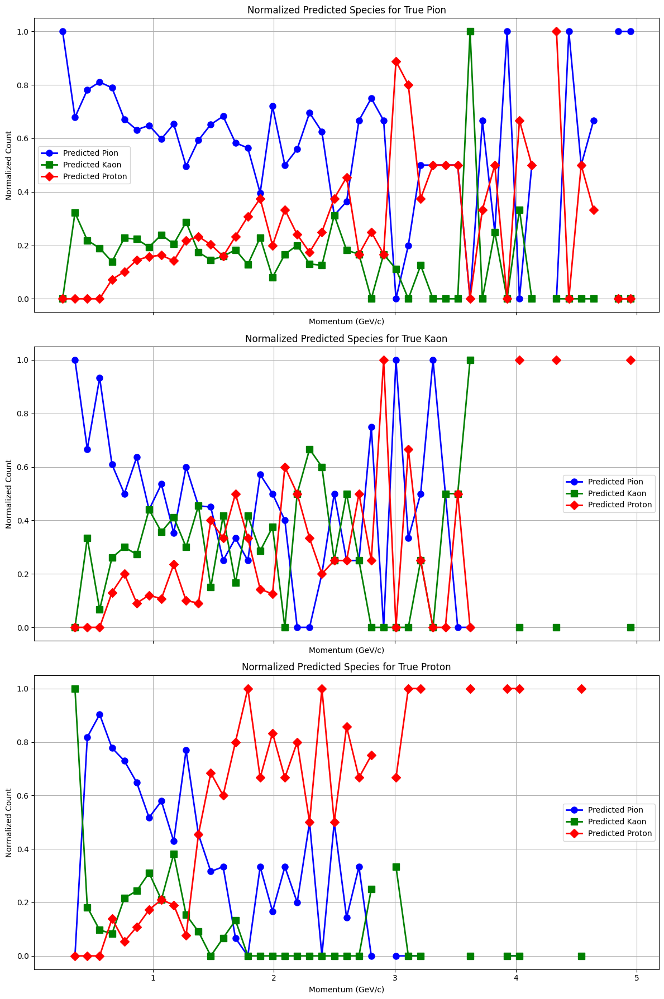
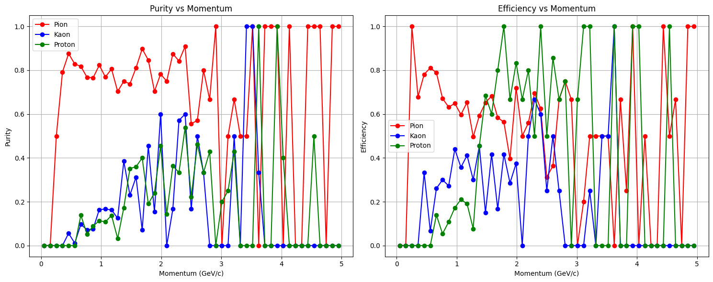

# Scatterplots
**make_ckov_prediction_cut_fig** in HMP_ML

#### Predicted specie kaon, probablity scatter plot per true specie

#### Predicted specie proton, probablity scatter plot per true specie

# Metrics comparison

## With masshypothesis :
Change by changning from **TrackAttributes_ckovReconMassHypThisTrack** to **TrackAttributes_ckovReconThisTrack** for **ckov_recon** in **calculate_contamination** 
### Section Contamination

### Section Normalised

### Section "Efficiciency and Purity vs momentum"

