# HMPID_ML.ipynb
[HMPID_ML.ipynb](HMPID_ML.ipynb)

section **check specie probs** > plot_attributes_and_scale

## Data-distributions

### Track attributes

#### Track inclination : thetaP
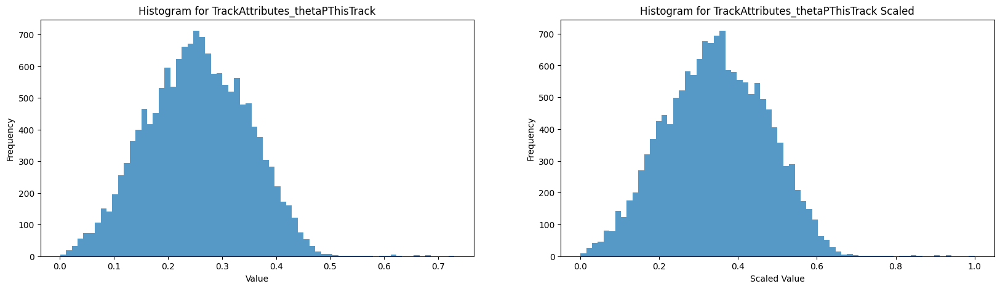

#### MIP-cluster charge : qMip
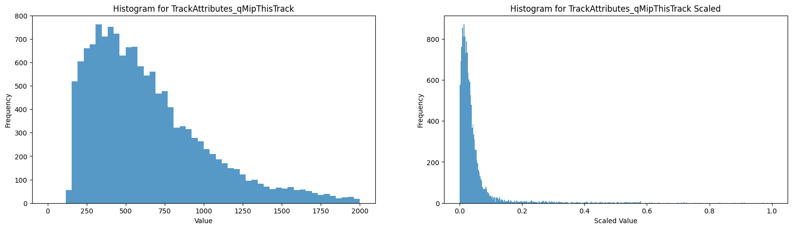

#### Momentum
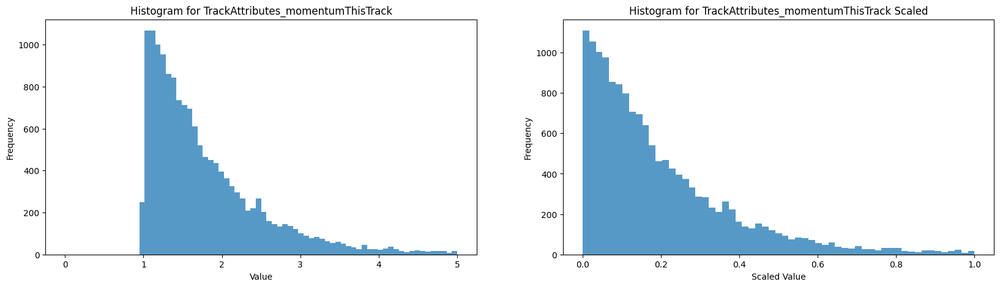

### Cluster attributes
#### Cluster-photon angular resolution  : sigmaRing
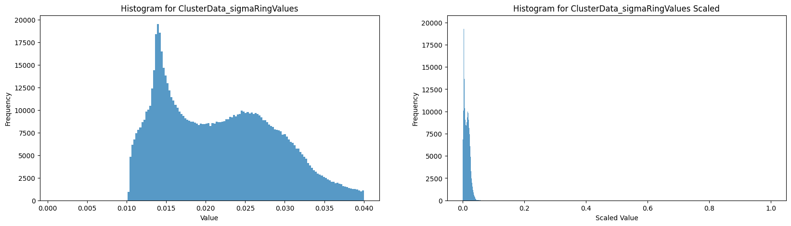

#### Single-photon ADC charge distribution
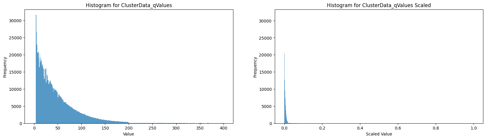

#### Single-photon cluster-size distribution
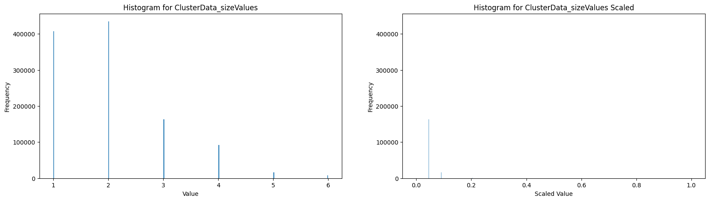

### Resolved cluster distributions

#### Raw Size distribution
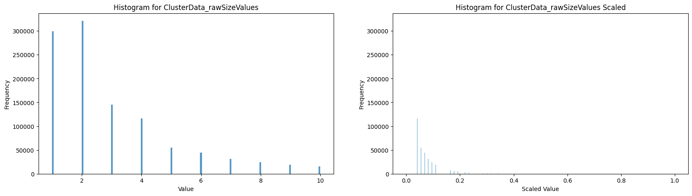

#### Number of deconvoluted clusters
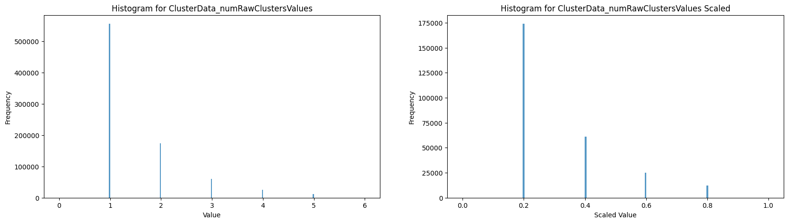

### HTM distribution 

### Specie Z-score distributions

section **raw z-score**
plot_ckov_probs(all_dicts)

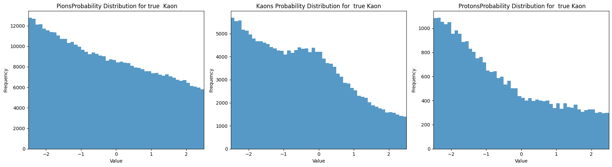
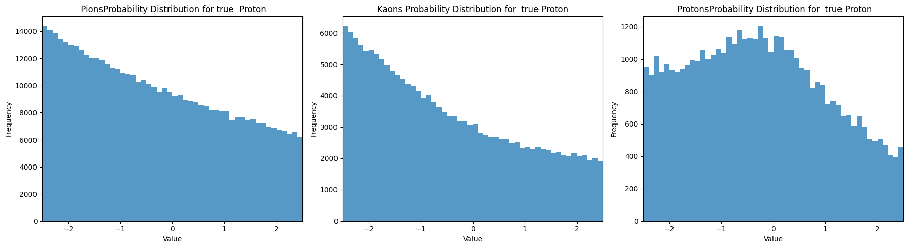

# Split distributions 

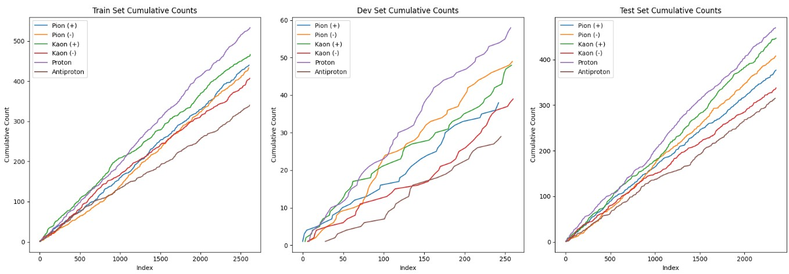

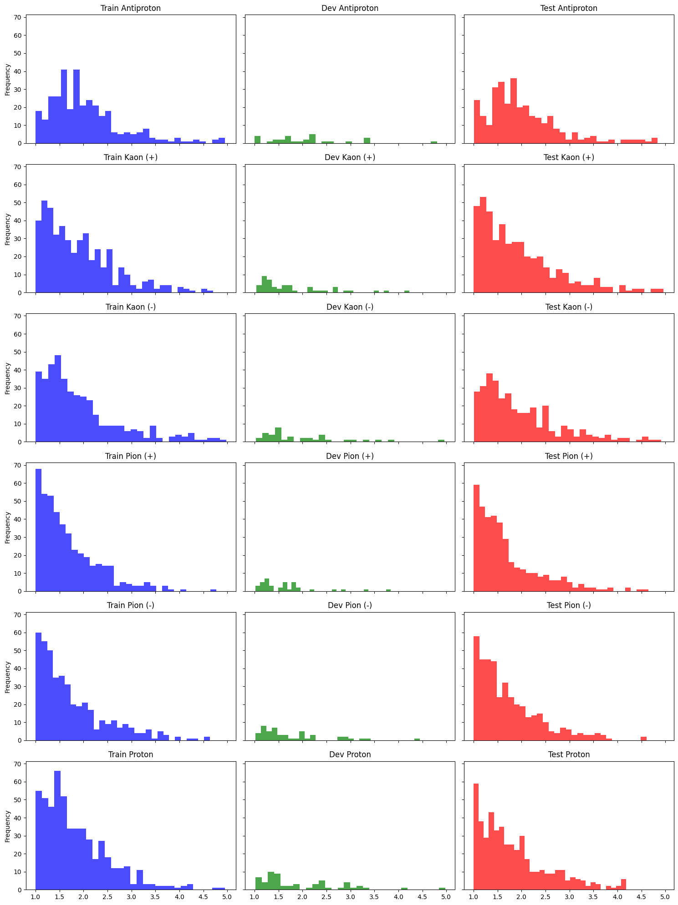

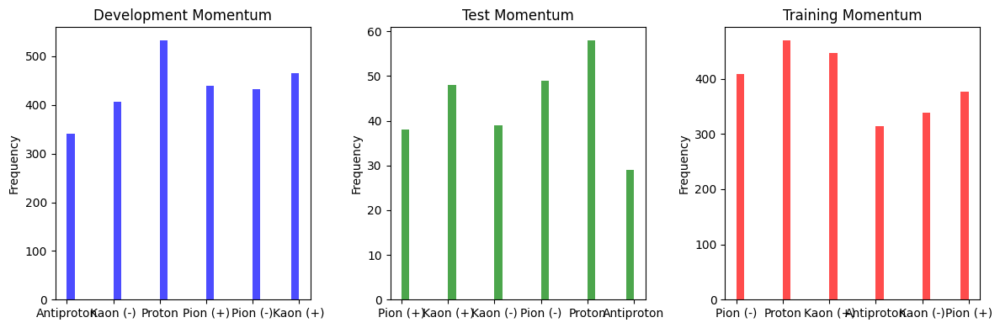

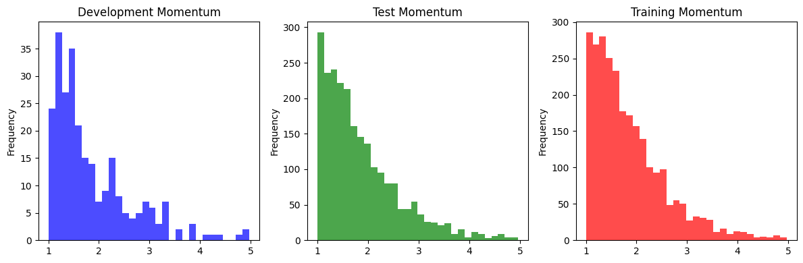

# Output plots 

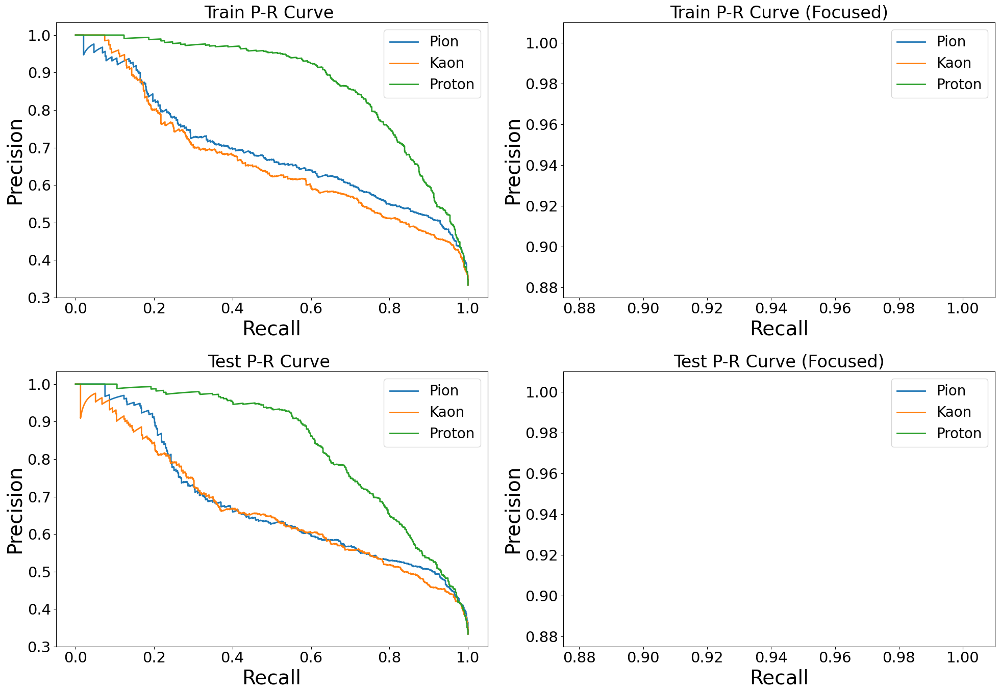

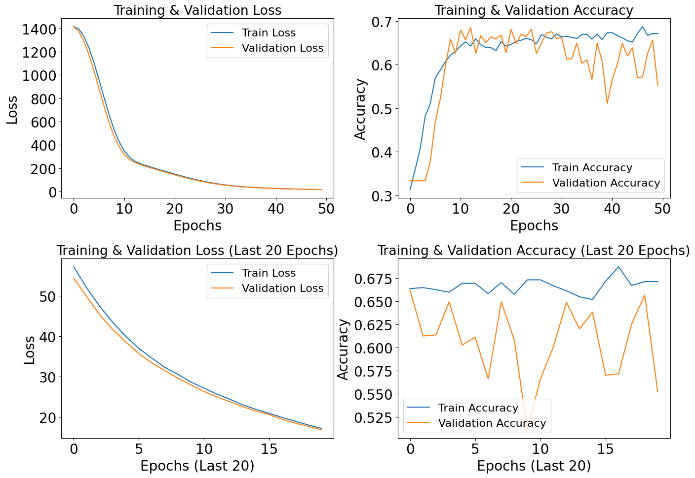

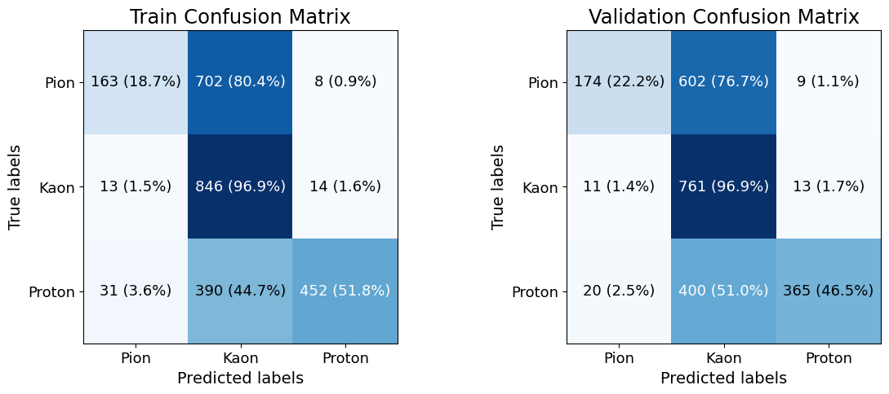

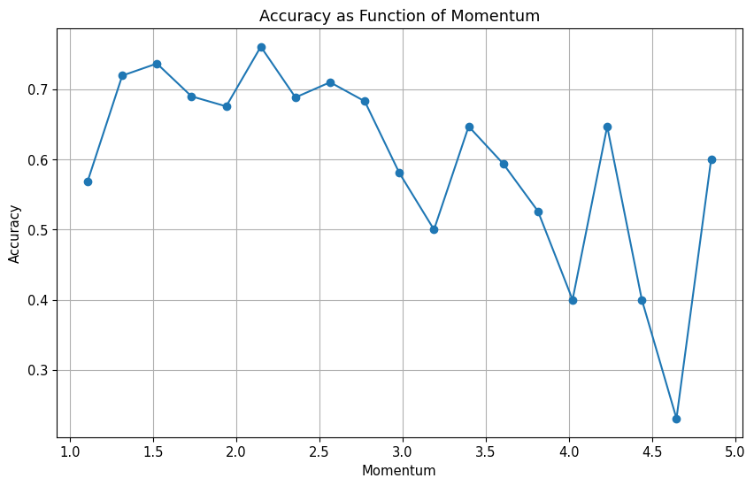

