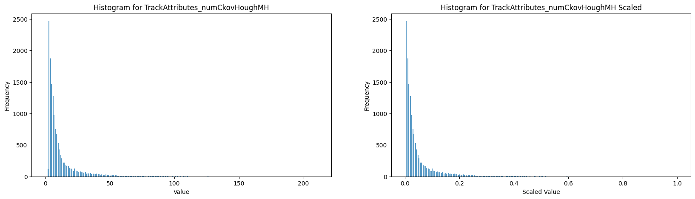
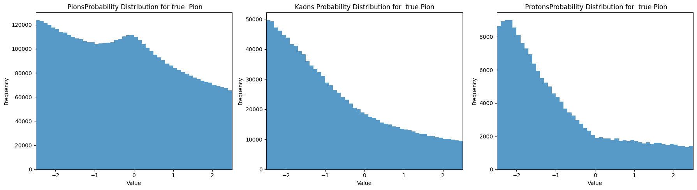
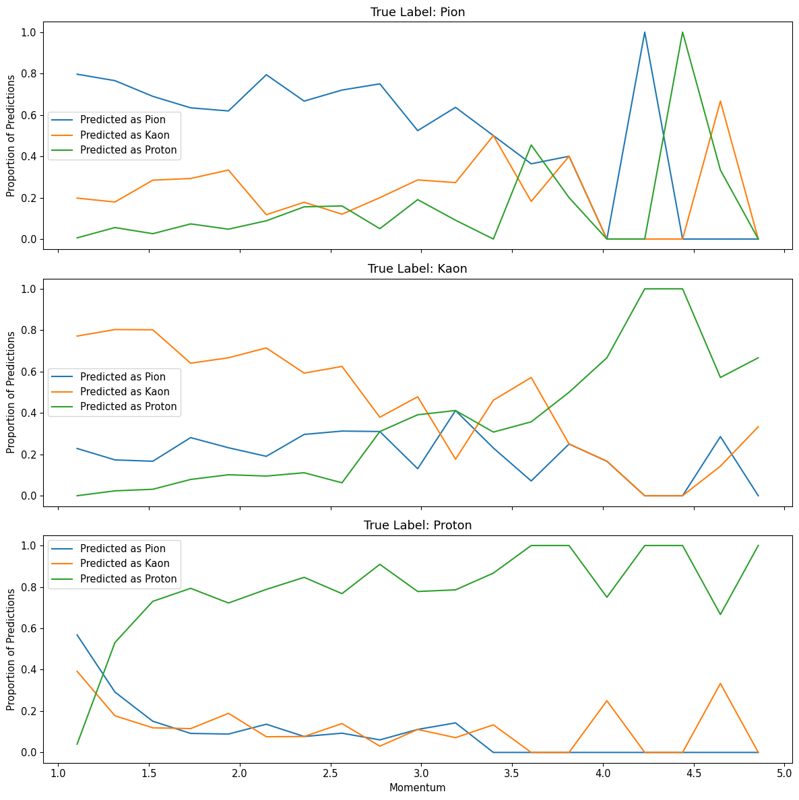

# HMPID_ML.ipynb
[HMPID_ML.ipynb](HMPID_ML.ipynb)

section **check specie probs** > plot_attributes_and_scale

## Data-distributions

### Track attributes

#### Track inclination : thetaP

#### MIP-cluster charge : qMip

#### Momentum

### Cluster attributes
#### Cluster-photon angular resolution  : sigmaRing

#### Single-photon ADC charge distribution

#### Single-photon cluster-size distribution

### Resolved cluster distributions

#### Raw Size distribution

#### Number of deconvoluted clusters

### HTM distribution 

### Specie Z-score distributions

section **raw z-score**
plot_ckov_probs(all_dicts)

# Split distributions 

# Output plots 

