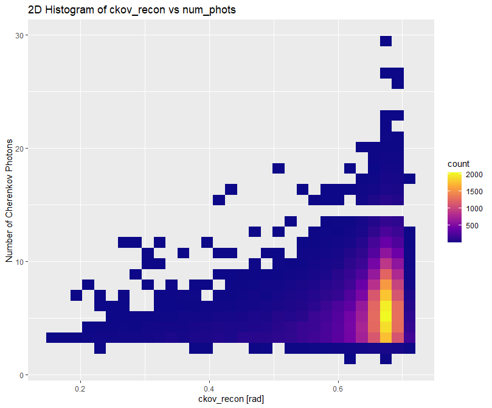
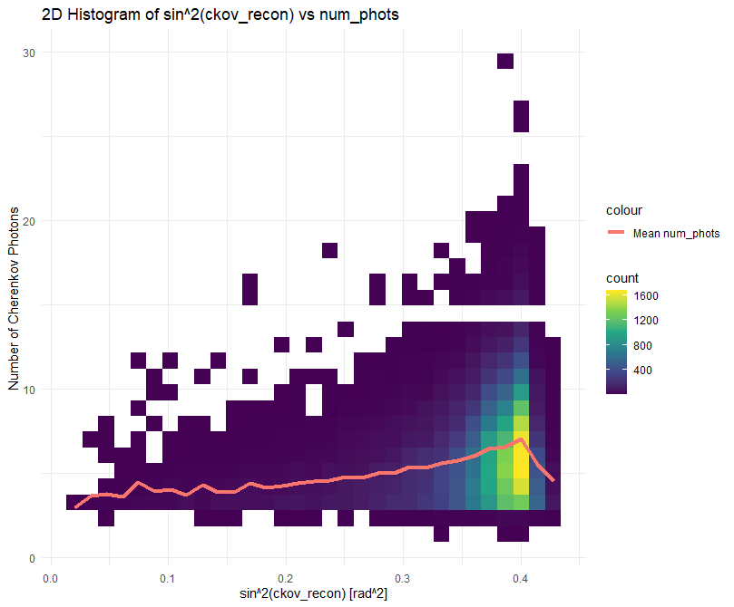
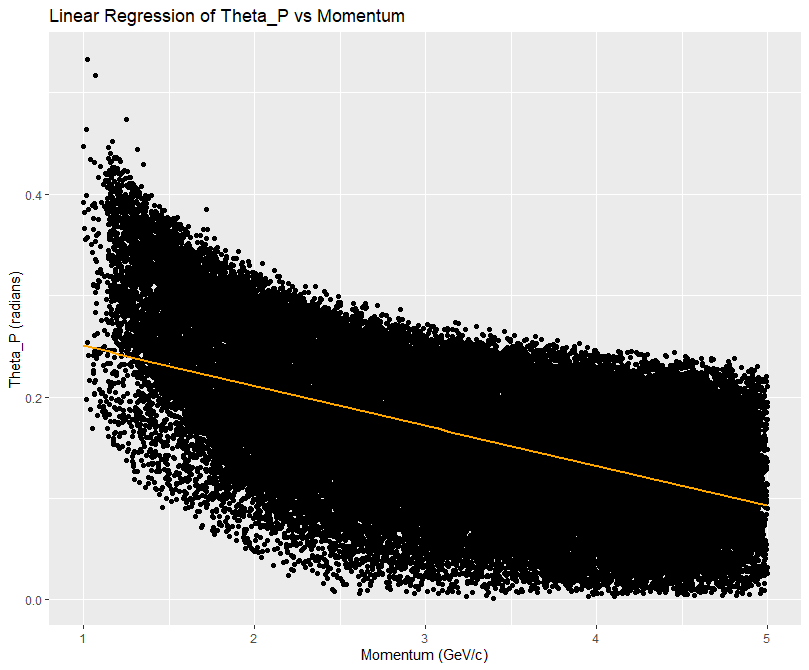
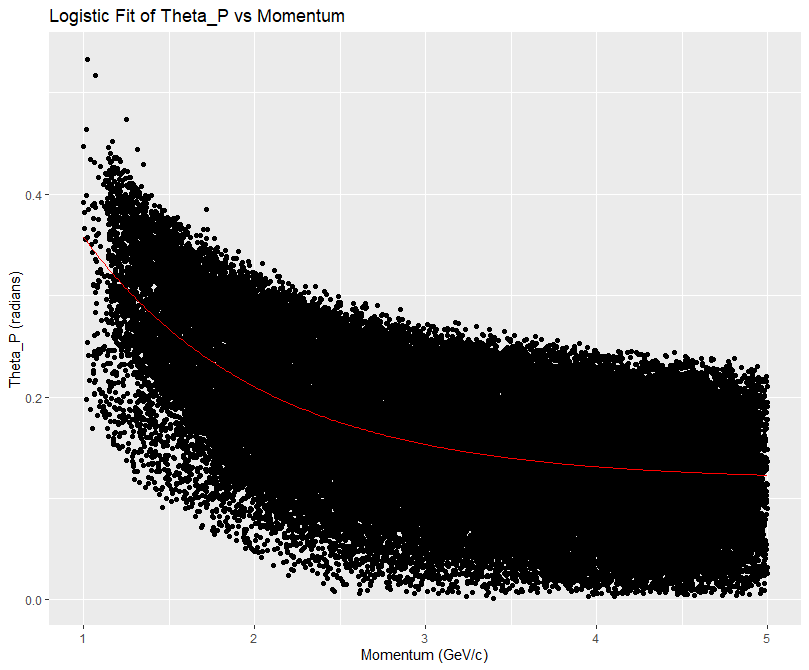

## Storing of CSV files

CSV files stored in [Stats/HMPStats2.ipynb](../Stats/HMPStats2.ipynb)

## numCkovPhots

[numCkovPhots](numCkovPhots.R)

### [numCkovPhots vs thetaC](https://github.com/eflatlan/HMPID_ML/blob/d3df0e70a88072860d447cecf9a6bb165d5f41dd/R/numCkovPhots.R#L104-L108)

### [numCkovPhots vs sin2(thetaC)](https://github.com/eflatlan/HMPID_ML/blob/d3df0e70a88072860d447cecf9a6bb165d5f41dd/R/numCkovPhots.R#L113-L117)

## ThetaP vs momentum
[momentum_thetaP](momentum_thetaP.R)

### [Linear regression, first pol degree](https://github.com/eflatlan/HMPID_ML/blob/d3df0e70a88072860d447cecf9a6bb165d5f41dd/R/momentum_thetaP.R#L40-L55)

### [Logistic regression](https://github.com/eflatlan/HMPID_ML/blob/d3df0e70a88072860d447cecf9a6bb165d5f41dd/R/momentum_thetaP.R#L59-L84)

