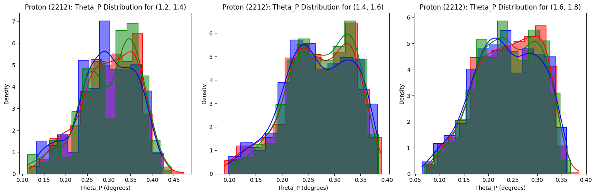

### Lambda (number of cherenkov photons) per specie as function of momentum

### Lambda (number of cherenkov photons) vs sin2

### Histogram of number of cherenkov photons for p = 1.1 GeV/c

### Histogram of number of cherenkov photons for p = 1.9 GeV/c

### Histogram of ThetaP for fixed momentums

### Histogram of ThetaP for fixed momentums

